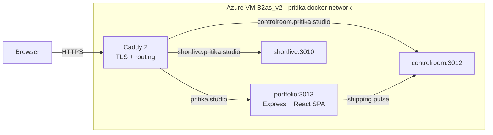

# portfolio

Personal landing page for Pritika Priyadarshini at [pritika.studio](https://pritika.studio).

## Live

[**pritika.studio**](https://pritika.studio): dark by default with a real light toggle, system-sans body, Geist display, animated mesh-gradient hero, live shipping pulse fetched from controlroom.

## What this is

Single-page personal site. The editorial spine is the Experience accordion: three companies (Paycom, VMware, Microsoft), each collapsible with a one-line summary visible and the full bullet history one click away. Two live demos (shortlive, controlroom) sit below as supporting evidence, and the footer carries contact links and a résumé download.

## Why this exists

The root of `pritika.studio` was a Caddy-hosted placeholder before v1; this is the real front door, with five years of production engineering up front and two shipped subdomain demos one click away.

## Architecture



Everything runs on a single Azure VM (`pritika-portfolio-vm`, B2as_v2, northcentralus) inside the shared `pritika` docker network. Caddy is the only external surface; it terminates TLS via Let's Encrypt and routes by hostname. The portfolio container exposes `:3013` to the docker network only; no host-side port mapping.

The Hero's velocity card fetches `controlroom.pritika.studio/api/pulse` on mount. If controlroom is unreachable, the card unmounts silently and the rest of the page renders unchanged.

## Data model

None. The site is a static React SPA built with Vite and served by Express. Content lives in JSX components under `src/client/sections/`.

## Tech stack

- **TypeScript strict mode** with `noUncheckedIndexedAccess`, `noImplicitOverride`, no `any` without a comment
- **React 19** using `createRoot` and `StrictMode`; no router (single-page scroll)
- **Vite 5** builds the client bundle; `publicDir` points at `public/` at the repo root so resume, favicon, and fonts land in `dist/client/`
- **Express 5** serves the built SPA plus a `/health` endpoint
- **Helmet** for CSP and HSTS; `connect-src` allowlists `controlroom.pritika.studio` for the shipping-pulse fetch
- **Tailwind 3** with theme tokens aliased to CSS variables, so the toggle is a one-line attribute flip on `<html>`
- **Geist Variable** for the hero display; system-sans for body text (zero web-font payload on first paint)
- **Node 24** on `alpine`, multi-stage Dockerfile, 259 MB runtime image

## Run locally

```sh
mise install
npm ci
npm run dev   # Vite at :5173 (proxies /api + /health to :3013), Express at :3013
```

Production smoke test:

```sh
npm run build
npm start
open http://localhost:3013
```

## Before every push

The v1 scope deliberately ships **without** GitHub Actions CI. To keep the security baseline honest, run the local audit before every push:

```sh
bash scripts/audit.sh
```

That runs the pre-commit gates (`gitleaks`, `shellcheck`, file hygiene, 500 KB ceiling), a manual regex sweep for `AKIA*` / `sk-*` / `ghp_*` / `github_pat_*` key shapes that gitleaks sometimes misses, and `npm audit --omit=dev --audit-level=high`. Any failure aborts the push.

## Deploy

First deploy is a one-shot manual invocation from the laptop:

```sh
az vm run-command invoke \
  --resource-group pritika-portfolio-rg \
  --name pritika-portfolio-vm \
  --command-id RunShellScript \
  --scripts @deploy/vm-bootstrap.sh
```

The script (`deploy/vm-bootstrap.sh`) clones (or pulls) into `/opt/pritika/portfolio`, runs `scripts/bootstrap-vm.sh` to materialize `/opt/pritika/_infra/portfolio.env`, `docker compose up -d --build`, and probes `/health` with a 60 s retry loop. Idempotent.

After the container is up, Caddy already routes `pritika.studio` to `portfolio:3013` on the internal network, with no DNS or TLS changes needed.

## Tests &amp; CI

**v1 ships without an automated test suite or GitHub Actions CI gate.** This is a deliberate trade for launch speed; the first follow-up PR adds both back before any further code lands (see *What's next*).

The site is small enough that a manual eyeball pass covers the regression surface:

- Hero renders cleanly at 320 / 768 / 1280 / 1920 px
- Theme toggle: instant transition, persisted across reload, system-preference honored on first visit, no FOUC
- Shipping pulse populates from controlroom or silently hides on failure
- Project cards: hover slides name + arrow, shifts border to accent, no layout shift
- All footer links work; `/pritika_resume.pdf` downloads; favicon renders
- No console errors; no `Generated by Vite` comments leaked into source

## Performance characteristics

Not benchmarked yet. The site is a static SPA behind Caddy on a B2as_v2 VM, so expect <100 ms TTFB on warm cache and well under 1 s LCP in any modern browser. The Geist Variable woff2 is the only web font (~70 KB); body type stays on the system stack so first paint never blocks on font load.

## Limitations &amp; honest scope

- **No tests, no CI on v1.** See *What's next*; the next PR adds both.
- **No OG image yet.** Twitter, LinkedIn, and Slack unfurls render as text-only previews until v1.2 ships the generator.
- **No blog.** Nothing to write about yet that isn't already on the live site or in the demo repos.
- **No third-party analytics.** `pulseboard` (one of the planned demos) will eventually own click tracking; first-party only.

## What's next

Each item below is a discrete PR landing before the one after it.

1. **v1.1, tests and CI gate.** `vitest` + `supertest` for the server, `vitest` + `jsdom` for the client. Lift `ci.yml` and `deploy.yml` from controlroom; OIDC + `az vm run-command` replaces the manual deploy. Must land before any further changes.
2. **v1.2, runtime OG image generator.** `@vercel/og` (satori + resvg) route at `/og/[slug].png`. Social previews stay current as copy evolves.
3. **v1.3, MDX blog.** Long-form writing surface for build-and-train explanations, retros, and notes from the demo repos.
4. **v1.4, analytics.** First-party only, wired through `pulseboard` once it lands. Never a third-party tracker.
